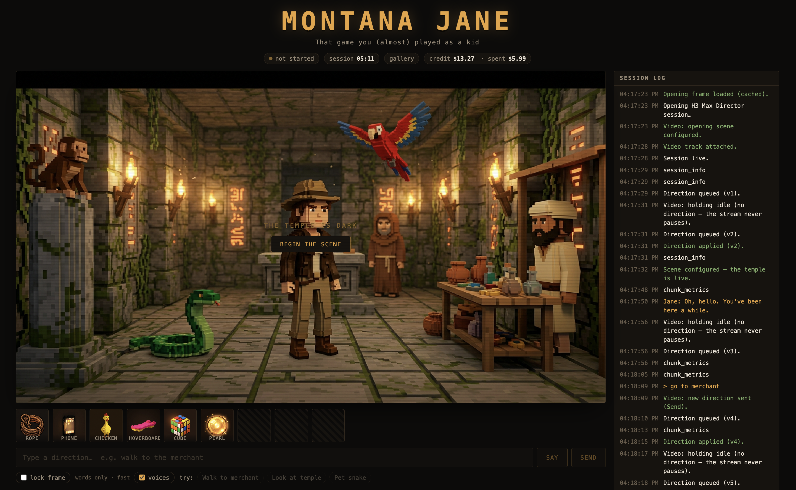
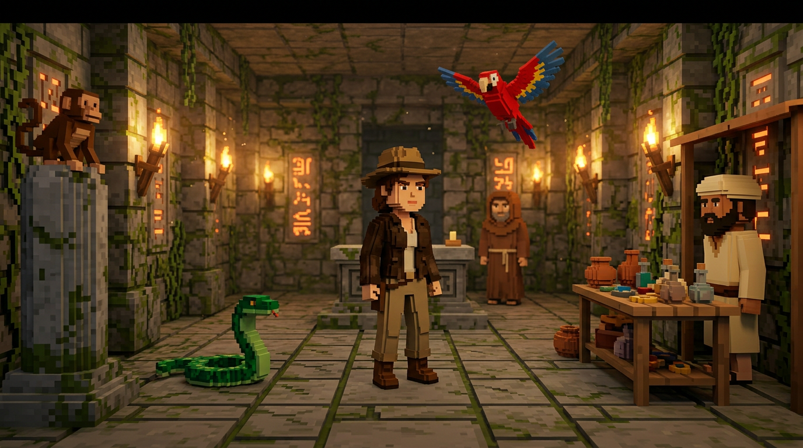

# Montana Jane

*That game you (almost) played as a kid.*

A live-generated point-and-click adventure. One screen: a video frame that streams a
continuous cinematic scene, and a text box underneath. Whatever you type steers the
scene while it plays. Nothing is pre-rendered — the world is generated as you play it.



Montana Jane is an archaeologist in a torchlit jungle temple, with a monkey, a parrot,
a snake, a temple keeper and a merchant for company.

The opening frame is generated before the stream starts, then pinned as the video's
exact first frame so there is no cut between the two:



## Running it

```bash
sh montana-jane.sh
```

That checks the key, installs dependencies on first run, picks a free port, waits
for the server and opens the browser. Ctrl-C stops it.

Or by hand:

```bash
export FAL_KEY=...        # https://fal.ai/dashboard/keys
cd web
npm install
npm run dev               # http://localhost:3000
```

`FAL_KEY` must be set in the **server** environment. It is read only by the API routes
and the fal proxy, and never reaches the browser. A `.env` file at the repo root works —
`web/.env.local` is symlinked to it.

> **This costs real money.** The video model bills per second of video generated, with a
> 60-second minimum per session — roughly **$1.20 every time you press Begin**, even if
> you stop immediately. The header shows your live fal balance and what the current
> session has spent.

## Using it

- **Begin the scene** — generates an opening still, then opens the live stream anchored on it.
- **Type + Send** — an action. *Walk to merchant*, *Pet snake*, *Look at temple*.
- **Type + Say** — dialogue. Jane speaks, one NPC answers once, both lines appear as
  bubbles above the characters.
- **Inventory** — click an item to have Jane use it.
- **lock frame** — optional, slower, tighter continuity. See below.
- **● Rec** — record the live stream to a file. It lands in the gallery when you stop.
- **/gallery** — everything generated so far, with the prompt behind each one.

## How it works

| Piece | Model |
|---|---|
| Live video | `minimax/h3-max/director` — realtime WebRTC, steerable mid-stream |
| Opening still, item icons | `fal-ai/nano-banana-2` |
| Keyframes | `fal-ai/nano-banana-pro/edit` |
| NPC dialogue | `google/gemini-2.5-flash` via fal's OpenRouter router |

The director is a **realtime WebRTC** model, not a request/response one. A session opens
with a `configure` message and then streams 10-second chunks continuously; `prompt`
messages redirect the action while it plays. `prompt_version` must strictly increase on
every message or it is rejected as stale.

Four things keep the scene from drifting, learned the hard way:

1. **`image_url` on `configure`** pins the generated still as the exact first frame, so
   there is no cut between the poster and the stream.
2. **The whole scene description is re-sent with every direction.** A `prompt` *replaces*
   the direction rather than adding to it — sending the bare words "Pet snake" describes a
   snake and nothing else, and you get a photorealistic snake in a void.
3. **The scene bible pins colour and position** for every character. A bare noun gets
   re-rolled each generation: "a parrot" comes back red, then blue. "A scarlet-red parrot
   with blue and yellow wing feathers, above her and slightly right" does not.
4. **`memory: 50`**, the documented ceiling, instead of the default 12.

`lock frame` adds a fifth, optional lock: it grabs the frame on screen, edits it so only
the action changes, and pins the result as the chunk's `end_image_url`. Tighter, but about
$0.04 and 15 seconds per direction, so it is off by default.

Dialogue and inventory are **DOM overlays, not generated pixels**. Video models cannot
render legible text, and every prompt here explicitly forbids lettering and HUD — the
first generated still arrived with a fake inventory bar and subtitles baked in.

## Notes

- Generated media is written to `web/public/generated/` and reused on later runs, keyed by
  a hash of its prompt, so nothing is billed twice. `manifest.jsonl` records the prompt
  behind every file.
- Recording uses `MediaRecorder` on the WebRTC stream, so the browser encodes it in native
  code with no per-frame work. It captures the model's video and audio, not the dialogue
  bubbles and inventory drawn over them — compositing those would mean redrawing every
  frame through a canvas in JavaScript, which is the cost worth avoiding mid-game.
- Chunks are a fixed 10 seconds. The 5–15s range the API mentions is only reachable
  through `script` beats, not on a live session.
- Sessions run up to about 15 minutes, then end with `stream_exhausted` and hold the last
  frame.

## The starter this grew out of

This began as the fal agentic-media hackathon starter (`agent.py`, a Python agent that
uses fal media models as tools). That is still here and untouched — see
[`agent.py`](agent.py) — but it is not part of the game: H3 realtime is WebRTC, so the
game is a browser app with a server proxy rather than a Python `subscribe()` call.
